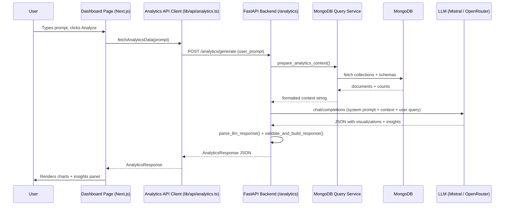

# Design Document: Dynamic Dashboard

## Overview

The dynamic dashboard feature lets users type a natural language question about the platform's environmental and RSE data and receive AI-generated chart visualizations and textual insights in response. The implementation is extracted from the LunarHackathon2026 microservices analytics module and adapted to fit the existing H12 AI Healing Gabès backend (Python/FastAPI + MongoDB) and web (Next.js 16 / React 19 / Recharts) projects.

The core flow is:
1. User types a prompt in the frontend.
2. Frontend POSTs to `/analytics/generate` on the FastAPI backend.
3. Backend fetches sample data and schema from MongoDB, formats it as LLM context, calls Codestral (Mistral API → OpenRouter fallback), parses the JSON response, and returns an `AnalyticsResponse`.
4. Frontend renders the charts using Recharts and displays the insights panel.

---

## Architecture



---

## Components and Interfaces

### Backend

#### `backend/features/analytics/` (new feature directory)

| File | Responsibility |
|---|---|
| `__init__.py` | Package marker |
| `schemas.py` | Pydantic models: `AnalyticsQueryRequest`, `ChartVisualization`, `AnalyticsResponse` |
| `mongodb_query_service.py` | Fetch collection data/schema from MongoDB, format context for LLM |
| `service.py` | LLM call (Mistral → OpenRouter), response parsing, validation |
| `routes.py` | FastAPI router: `POST /generate`, `GET /health` |

The router is registered in `backend/main.py` as:
```python
from features.analytics.routes import router as analytics_router
app.include_router(analytics_router, prefix="/analytics", tags=["Analytics"])
```

#### Key Python interfaces

```python
# schemas.py
class AnalyticsQueryRequest(BaseModel):
    user_prompt: str

class ChartVisualization(BaseModel):
    chart_type: Literal["bar", "line", "pie", "area", "scatter"]
    title: str
    description: Optional[str] = None
    data_points: List[Dict[str, Any]]
    x_axis: Optional[str] = None
    y_axis: Optional[str] = None
    colors: Optional[List[str]] = None

class AnalyticsResponse(BaseModel):
    success: bool
    query_interpretation: str
    visualizations: List[ChartVisualization]
    insights: str
    summary: Optional[str] = None
    data_sources: Optional[List[str]] = None
    error: Optional[str] = None
```

### Frontend

#### New files in `web/`

| File | Responsibility |
|---|---|
| `lib/api/analytics.ts` | Typed API client: `fetchAnalyticsData`, `checkAnalyticsHealth`, exported types |
| `app/(dashboard)/analytics/page.tsx` | Next.js page at `/dashboard/analytics` |
| `app/(dashboard)/analytics/analytics.types.ts` | TypeScript types mirroring backend schemas |
| `app/(dashboard)/analytics/analytics.constants.ts` | Example prompts, chart colors, UI strings |
| `app/(dashboard)/analytics/(components)/analytics-overview-page.tsx` | Main client component orchestrating state |
| `app/(dashboard)/analytics/(components)/prompt-input.tsx` | Textarea + submit + example prompts |
| `app/(dashboard)/analytics/(components)/analytics-display.tsx` | Grid of charts + insights panel |
| `app/(dashboard)/analytics/(components)/chart-container.tsx` | Single chart renderer (Recharts) |
| `app/(dashboard)/analytics/(components)/insights-panel.tsx` | Query interpretation + insights + summary + sources |
| `app/(dashboard)/analytics/(components)/loading-state.tsx` | Spinner card |
| `app/(dashboard)/analytics/(components)/error-state.tsx` | Error alert + retry button |

---

## Data Models

### Backend Pydantic Models

```python
# AnalyticsQueryRequest — inbound
{
  "user_prompt": "Show me pollution trends by company"
}

# AnalyticsResponse — outbound
{
  "success": true,
  "query_interpretation": "User wants a breakdown of pollution metrics per company",
  "visualizations": [
    {
      "chart_type": "bar",
      "title": "SO2 Emissions by Company",
      "description": "Average SO2 ppm per company in the latest month",
      "data_points": [{"label": "GCT", "value": 142.5}, {"label": "SIAPE", "value": 98.3}],
      "x_axis": "Company",
      "y_axis": "SO2 (ppm)"
    }
  ],
  "insights": "GCT has the highest SO2 emissions at 142.5 ppm, 45% above the regional average.",
  "summary": "Pollution levels vary significantly across companies.",
  "data_sources": ["pollution_metrics", "companies"]
}
```

### TypeScript Types

```typescript
export type ChartType = "bar" | "line" | "pie" | "area" | "scatter";

export interface ChartVisualization {
  chart_type: ChartType;
  title: string;
  description?: string;
  data_points: Record<string, number | string | null>[];
  x_axis?: string;
  y_axis?: string;
  colors?: string[];
}

export interface AnalyticsResponse {
  success: boolean;
  query_interpretation: string;
  visualizations: ChartVisualization[];
  insights: string;
  summary?: string;
  data_sources?: string[];
  error?: string;
}

export interface AnalyticsQueryRequest {
  user_prompt: string;
}

export interface AnalyticsState {
  loading: boolean;
  error: string | null;
  data: AnalyticsResponse | null;
  lastPrompt: string | null;
}
```

### MongoDB Collections Used

The MongoDB Query Service queries the following collections from the existing `h12_gabes` database:

- `pollution_metrics` — pollution readings (pollutant, value, unit, location, company, month)
- `rse_scores` — RSE scores per company (environmental, social, governance, overall, grade)
- `companies` — company metadata (name, sector, location, description)

---

## Correctness Properties

*A property is a characteristic or behavior that should hold true across all valid executions of a system — essentially, a formal statement about what the system should do. Properties serve as the bridge between human-readable specifications and machine-verifiable correctness guarantees.*

### Property 1: Whitespace prompt rejection

*For any* string composed entirely of whitespace characters (or with fewer than 5 non-whitespace characters), submitting it as `user_prompt` to the analytics endpoint should result in an HTTP 400 response and the submit handler should never be called on the frontend.

**Validates: Requirements 1.2, 6.2, 6.3**

---

### Property 2: LLM JSON parse round-trip

*For any* valid JSON object, wrapping it in arbitrary surrounding text (including markdown code fences) and passing it to `parse_llm_response` should return `{"success": True, "data": <original_object>}`.

**Validates: Requirements 3.4**

---

### Property 3: Invalid JSON parse failure

*For any* string that contains no valid JSON object (no `{` ... `}` pair), `parse_llm_response` should return `{"success": False, "error": <non-empty string>}`.

**Validates: Requirements 3.5**

---

### Property 4: Response shape invariant

*For any* valid parsed LLM data dict passed to `validate_and_build_response`, the returned `AnalyticsResponse` should have `success: true`, a non-empty `query_interpretation`, a list of `ChartVisualization` objects each with a valid `chart_type`, and a non-empty `insights` string.

**Validates: Requirements 4.1, 4.3**

---

### Property 5: Unknown chart_type defaults to bar

*For any* string not in `{"bar", "line", "pie", "area", "scatter"}` used as `chart_type` in a visualization dict, `validate_and_build_response` should produce a `ChartVisualization` with `chart_type == "bar"`.

**Validates: Requirements 4.3**

---

### Property 6: MongoDB context format completeness

*For any* context dict produced by `prepare_analytics_context`, calling `format_context_for_llm` should return a string that contains each collection name, its document count, and at least one field name from its schema.

**Validates: Requirements 2.3**

---

### Property 7: Collection schema field type mapping

*For any* MongoDB document with N fields, `get_collection_schema` should return a schema dict with exactly N entries, each mapping the field name to a non-empty Python type name string.

**Validates: Requirements 2.2**

---

### Property 8: API client error propagation

*For any* HTTP error status code (4xx or 5xx) returned by the backend, `fetchAnalyticsData` should throw an `Error` whose message contains the status code as a substring.

**Validates: Requirements 5.3**

---

### Property 9: Analytics display renders one chart per visualization

*For any* `AnalyticsResponse` with `success: true` and N visualizations, the `Analytics_Display` component should render exactly N `ChartContainer` elements, and the `InsightsPanel` should contain the `query_interpretation` and `insights` text.

**Validates: Requirements 7.1, 7.3**

---

## Error Handling

| Scenario | Backend behavior | Frontend behavior |
|---|---|---|
| Empty/whitespace `user_prompt` | HTTP 400 + descriptive message | Inline validation error, no API call |
| Mistral API unavailable | Fall back to OpenRouter | — |
| Both LLM providers fail | `AnalyticsResponse(success=False, error=...)` | `ErrorState` with retry button |
| LLM returns non-JSON | `parse_llm_response` returns failure dict → `AnalyticsResponse(success=False)` | `ErrorState` with retry button |
| MongoDB collection unreachable | Partial context with `error` field, continues with available data | — |
| Backend returns non-200 | — | `fetchAnalyticsData` throws `Error` with status code |
| `AnalyticsResponse.success == false` | — | `fetchAnalyticsData` throws `Error` with `error` field |
| Empty `data_points` in visualization | — | `ChartContainer` renders "No data available" placeholder |

---

## Testing Strategy

### Dual Testing Approach

Both unit tests and property-based tests are required and complementary:
- **Unit tests** cover specific examples, integration points, and edge cases.
- **Property tests** verify universal correctness across randomly generated inputs.

### Backend (Python)

**Property-based testing library**: `hypothesis`

Each property test runs a minimum of 100 iterations. Tests are tagged with:
`# Feature: dynamic-dashboard, Property N: <property_text>`

Property tests to implement:
- **Property 1** (whitespace rejection): `@given(st.text(alphabet=string.whitespace))` → assert HTTP 400
- **Property 2** (JSON parse round-trip): `@given(st.dictionaries(...))` → wrap in markdown, parse, assert round-trip
- **Property 3** (invalid JSON failure): `@given(st.text().filter(lambda s: '{' not in s))` → assert success=False
- **Property 4** (response shape invariant): `@given(valid_llm_data_strategy())` → assert all fields present
- **Property 5** (unknown chart_type defaults to bar): `@given(st.text().filter(lambda s: s not in VALID_CHART_TYPES))` → assert chart_type=="bar"
- **Property 6** (context format completeness): `@given(context_dict_strategy())` → assert collection names in output
- **Property 7** (schema field type mapping): `@given(st.dictionaries(st.text(), st.one_of(...)))` → assert N fields

Unit tests to implement:
- Health endpoint returns 200 + `{"status": "healthy"}`
- `validate_and_build_response(None)` returns `success=False`
- LLM fallback: Mistral fails → OpenRouter called
- Both providers fail → combined error message
- `data_sources` populated with collection names

### Frontend (TypeScript)

**Property-based testing library**: `fast-check` (already compatible with Vitest/Jest)

Each property test runs a minimum of 100 iterations. Tests are tagged with:
`// Feature: dynamic-dashboard, Property N: <property_text>`

Property tests to implement:
- **Property 1** (whitespace/short prompt rejection): `fc.string()` filtered to whitespace/short → assert no submit call
- **Property 8** (API client error propagation): `fc.integer({min: 400, max: 599})` → assert error message contains status
- **Property 9** (display renders N charts): `fc.array(chartVisualizationArbitrary())` → assert N ChartContainers rendered

Unit tests to implement:
- `checkAnalyticsHealth` returns `true` on 200, `false` on non-200
- `fetchAnalyticsData` throws with `error` field when `success: false`
- `PromptInput` renders textarea, submit button, and ≥3 example buttons
- `PromptInput` disables controls when `isLoading=true`
- `Analytics_Display` renders `LoadingState` when loading
- `Analytics_Display` renders `ErrorState` with retry when error present
- `Analytics_Display` renders empty-state placeholder when no data
- `ChartContainer` renders "No data available" when `data_points` is empty
- Dashboard page metadata title is correct
